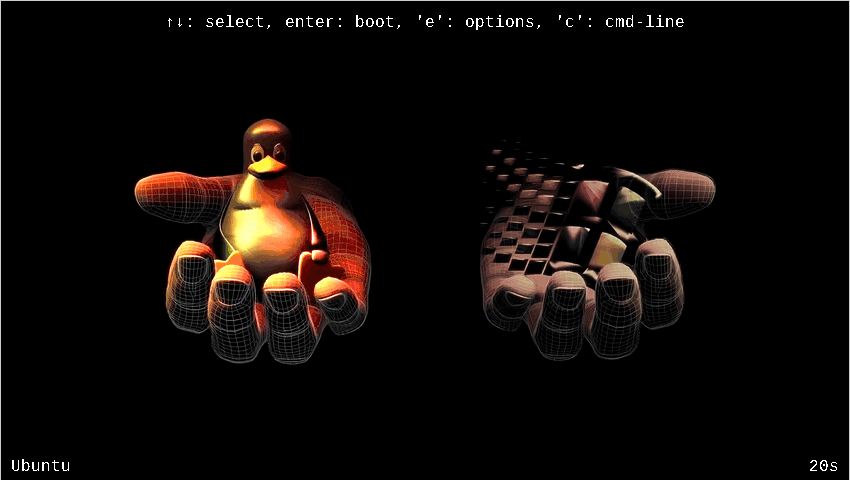

# 🎨 WinTux Dualboot Fullscreen GRUB Theme - Enhanced

<div align="center">



**Beautiful fullscreen GRUB theme for dual-boot**  
*One-command installation!*

[](LICENSE.txt)
[](https://www.gnu.org/software/grub/)

</div>

---

## 🙏 Credits

**Original Creator:** [@AlexanderKh](https://github.com/AlexanderKh) - [Original Repository](https://github.com/AlexanderKh/wintux-dualboot-fullscreen-grub-theme)  
**Artwork:** [@ABOhiccups](https://www.pling.com/u/abohiccups) - [View on Pling](https://www.pling.com/p/1497147)

**Huge thanks to @AlexanderKh for creating this innovative fullscreen GRUB theme!**

**My Contribution:** Enhanced with automated installation, bug fixes, and multi-distro support.

---

## 🚀 Installation

```bash
sudo ./universal-installer.sh
```

Done! Auto-installs everything.

---

## 📋 Requirements

**Packages:** imagemagick, grub (auto-installed)  
**Distros:** Arch, Ubuntu, Debian, Fedora, openSUSE

---

## License

See [LICENSE](LICENSE)
